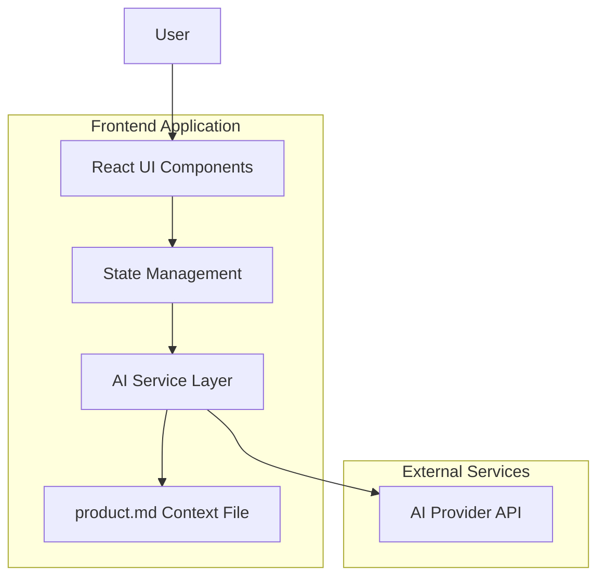

# Design Document

## Overview

NammaMysuru is a single-page React web application that provides an AI-powered local guide experience for Mysuru (Mysore), Karnataka. The application features Mysa, a friendly local guide character who helps users discover the city's food, Dasara traditions, and walking routes through an interactive chat interface.

Mysa is treated as a first-class product persona: a friendly young Mysuru local that users “meet” inside the app, with personality and constraints defined in product.md rather than hard-coded into the UI.

The system architecture follows a clean separation between the presentation layer (React components), business logic (state management and AI service), and data layer (context file and chat history). The design emphasizes cultural authenticity through a custom context file (product.md) that encodes local knowledge and response guidelines.

## Architecture

### High-Level Architecture



### Technology Stack

- **Frontend Framework**: React 18 with TypeScript
- **Build Tool**: Vite for fast development and optimized builds
- **Styling**: Tailwind CSS with custom heritage-inspired color palette
- **State Management**: React hooks (useState, useEffect) for local component state
- **AI Integration**: Modular service layer with placeholder for various AI providers
- **Context Management**: Static markdown file (product.md) loaded as system context

### Deployment Architecture

The initial version of NammaMysuru is designed as a static single-page application deployed on a static host (e.g., Vercel or Netlify). AI calls are routed through a single serverless function that reads product.md and forwards requests to the AI provider.

Deployment pattern:
1. Static SPA (React + Vite) served from CDN.
2. Single serverless function `/api/mysa` that:
   - Loads product.md into memory (with basic caching).
   - Accepts mode, chat history, and latest user message.
   - Calls the AI provider and returns Mysa's reply.


## Components and Interfaces

### Component Hierarchy

```
App
├── Header
├── ModeTabs
├── MainContent
│   ├── ChatPane
│   │   ├── MessageBubble (multiple)
│   │   └── ChatInput
│   └── SuggestionCards
└── ErrorBoundary
```

### Core Components

#### App Component
- **Purpose**: Root component managing global state and layout
- **State**: Current mode, chat messages, loading state
- **Responsibilities**: Coordinate between child components, handle AI service calls

#### Header Component
- **Props**: None
- **Purpose**: Display application branding and tagline
- **Features**: NammaMysuru title with Mysuru heritage styling

#### ModeTabs Component
- **Props**: `mode: Mode`, `onChange: (mode: Mode) => void`
- **Purpose**: Allow users to switch between Food, Dasara, and Walks modes
- **Features**: Visual feedback for active mode, responsive pill-style buttons

#### ChatPane Component
- **Props**: `messages: ChatMessage[]`, `onSubmit: (message: string) => void`, `loading: boolean`
- **Purpose**: Display conversation history and handle user input
- On initial load, ChatPane SHALL display a default greeting message from Mysa introducing NammaMysuru and suggesting 1–2 starter questions.
- **Features**: Scrollable message area, input field with submit button, loading indicator

#### MessageBubble Component
- **Props**: `role: 'user' | 'assistant'`, `content: string`, `timestamp?: number`
- **Purpose**: Render individual chat messages with appropriate styling
- **Features**: Different styling for user vs Mysa messages, timestamp display

#### SuggestionCards Component
- **Props**: `mode: Mode`, `onSelect: (prompt: string) => void`
- **Purpose**: Display clickable suggestion prompts based on current mode
- **Features**: Mode-specific suggestions, responsive grid layout

### Type Definitions

```typescript
export type Mode = 'food' | 'dasara' | 'walks';

export interface ChatMessage {
  id: string;
  role: 'user' | 'assistant';
  content: string;
  mode: Mode;
  timestamp: number;
}

export interface CallMysaParams {
  mode: Mode;
  messages: ChatMessage[];
  latestUserMessage: string;
  contextContent: string;
}

export interface SuggestionPrompt {
  id: string;
  text: string;
  mode: Mode;
}
```

## Data Models

### Chat Message Model
- **id**: Unique identifier for each message
- **role**: Distinguishes between user and assistant messages
- **content**: The actual message text
- **mode**: The conversation mode when the message was sent
- **timestamp**: When the message was created

### Mode Configuration Model
- **mode**: The mode identifier ('food', 'dasara', 'walks')
- **label**: Display name for the mode
- **icon**: Emoji or icon representation
- **suggestions**: Array of pre-written prompts for this mode

### Context File Structure
The product.md file follows a strict, mode-oriented format:
- **Mysa Personality**: global tone, style, and safety rules.
- **Global Rules**: guidelines that apply to all answers.
- **Food Section**: knowledge and rules for Mode 'food'.
- **Dasara Section**: knowledge and rules for Mode 'dasara'.
- **Walks Section**: knowledge and rules for Mode 'walks'.
- **Fallback Behavior**: how Mysa responds when information is missing or uncertain.

## Correctness Properties

*A property is a characteristic or behavior that should hold true across all valid executions of a system—essentially, a formal statement about what the system should do. Properties serve as the bridge between human-readable specifications and machine-verifiable correctness guarantees.*

### Property Reflection

After reviewing the prework analysis, several properties can be consolidated to eliminate redundancy:

- Properties 1.3 and 3.1 both test mode-specific suggestion display - these will be combined
- Properties 2.3 and 4.1 both test context passing to AI service - these will be combined  
- Properties 6.2 and 7.3 both test parameter passing to AI service - these will be combined
- Properties 5.3, 8.4 test similar responsive behavior - these will be combined

### Correctness Properties

**Property 1: Mode selection updates interface state**
*For any* mode selection (Food, Dasara, Walks), clicking that mode tab should activate the mode and display the corresponding suggestion cards
**Validates: Requirements 1.2, 1.3, 3.1**

**Property 2: Chat history preservation across mode switches**
*For any* existing chat history and any mode switch, the chat messages should remain visible while suggestion cards update to match the new mode
**Validates: Requirements 1.5**

**Property 3: Message submission adds to chat history**
*For any* valid user message, submitting it should result in the message appearing in the chat history with correct user role and timestamp
**Validates: Requirements 2.1**

**Property 4: AI service receives complete context**
*For any* user message, the AI service call should include the current mode, full message history, latest user message, and complete product.md content as parameters
**Validates: Requirements 2.3, 4.1, 6.2, 7.3**

**Property 5: AI responses display in chat interface**
*For any* AI service response, the returned content should appear in the chat interface as a message with assistant role and proper styling
**Validates: Requirements 2.4**

**Property 6: Loading state during AI processing**
*For any* AI service call, a loading indicator should be visible while the request is in progress and hidden once the response is received
**Validates: Requirements 2.5**

**Property 7: Message role determines styling**
*For any* chat message, user messages and assistant messages should have visually distinct styling (alignment, colors, or other visual indicators)
**Validates: Requirements 2.6**

**Property 8: Suggestion card interaction submits message**
*For any* suggestion card, clicking it should automatically submit that suggestion text as a user message in the current mode
**Validates: Requirements 3.2**

**Property 9: Mode-appropriate suggestion count**
*For any* active mode, the system should display between 2-4 suggestion cards that are contextually relevant to that mode
**Validates: Requirements 3.3**

**Property 10: Responsive layout adaptation**
*For any* viewport size change, the layout should adapt appropriately (side-by-side on desktop, stacked on mobile) without losing functionality
**Validates: Requirements 5.3, 8.1, 8.2, 8.4**

**Property 11: Touch target accessibility**
*For any* interactive element (buttons, cards, input fields), the touch target size should meet minimum accessibility requirements for mobile interfaces
**Validates: Requirements 8.3**

**Property 12: Context file updates reflect in AI calls**
*For any* modification to the product.md file, subsequent AI service calls should include the updated content as context
**Validates: Requirements 7.1**

**Property 13: AI service error handling**
*For any* AI service failure or timeout, the system should display a user-friendly error message and provide a retry option
**Validates: Requirements 6.4, 9.1, 9.2**

## Error Handling

### AI Service Errors
- **Network failures**: Display "Connection issue - please try again" with retry button
- **Service timeouts**: Display "Mysa is taking longer than usual - please retry" with retry option
- **Invalid responses**: Log error and display generic "Sorry, I couldn't understand that" message

### Context File Errors
- **Missing product.md**: Use built-in fallback responses with basic Mysuru information
- **Malformed content**: Log warning and use available sections, skip corrupted parts
- **Empty sections**: Provide generic responses and suggest checking back later

### User Input Validation
- **Empty messages**: Disable submit button until user types content
- **Extremely long messages**: Truncate or warn user about length limits
- **Special characters**: Sanitize input to prevent injection attacks

## Testing Strategy

### Dual Testing Approach

Given the time constraints of the weekly challenge, not all tests may be fully implemented, but this section defines the ideal testing strategy for future iterations.

The NammaMysuru application will use both unit testing and property-based testing to ensure comprehensive coverage:

- **Unit tests** verify specific examples, edge cases, and error conditions
- **Property tests** verify universal properties that should hold across all inputs
- Together they provide comprehensive coverage: unit tests catch concrete bugs, property tests verify general correctness

### Unit Testing Requirements

Unit tests will cover:
- Component rendering with specific props and state combinations
- User interaction flows (clicking buttons, typing messages, selecting modes)
- Error boundary behavior and fallback UI states
- Integration points between components and the AI service
- Specific edge cases like empty chat history, network failures, and malformed context

### Property-Based Testing Requirements

Property-based testing will use **fast-check** library for JavaScript/TypeScript. Each property-based test will:
- Run a minimum of 100 iterations to ensure thorough coverage
- Be tagged with comments explicitly referencing the correctness property from this design document
- Use the format: `**Feature: namma-mysuru-guide, Property {number}: {property_text}**`
- Generate appropriate test data (random messages, mode selections, UI states)

Each correctness property listed above will be implemented by a single property-based test that validates the universal behavior across all valid inputs.

### Test Data Generation

Property tests will use smart generators that:
- Generate valid chat messages with realistic content lengths
- Create various UI states (different modes, chat histories, loading states)
- Simulate different viewport sizes and device types
- Generate valid and invalid AI service responses
- Create various product.md content structures

## Implementation Notes

### State Management Strategy
The application uses React's built-in state management with hooks:
- `useState` for component-local state (input values, loading states)
- `useEffect` for side effects (AI service calls, context file loading)
- State lifting to the App component for shared state (current mode, chat history)

### AI Service Abstraction
The AI service is implemented as a separate module with a clean interface:
```typescript
export async function callMysa(params: CallMysaParams): Promise<string>
```
This allows easy swapping of AI providers without changing UI components.

### Context File Loading
The product.md file is loaded at application startup and cached in memory. Updates require application refresh, which is acceptable for this use case.

### Performance Considerations
- Chat history is stored in memory only (no persistence required)
- Suggestion cards are pre-defined and cached
- AI service calls are debounced to prevent rapid-fire requests
- Images and assets are optimized for fast loading

### Accessibility Features
- Semantic HTML structure with proper ARIA labels
- Keyboard navigation support for all interactive elements
- Screen reader friendly message announcements
- High contrast color scheme meeting WCAG guidelines
- Touch targets meeting minimum size requirements (44px minimum)